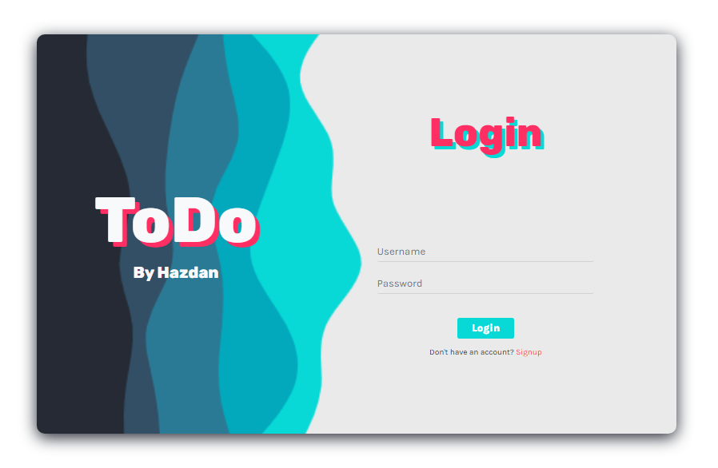

<center>

[![Stargazers][stars-shield]][stars-url]
[![MIT License][license-shield]][license-url]
[![LinkedIn][linkedin-shield]][linkedin-url]

</center>

<!-- PROJECT LOGO -->
<br />
<p align="center">
  <a href="https://github.com/Hazdan/todo">
    
  </a>

  <h3 align="center">ToDo</h3>

  <p align="center">
    A simple todo app make with django
    <br />
    <a href="https://github.com/Hazdan/todo"><strong>Explore the docs »</strong></a>
    <br />
    <br />
  </p>
</p>


<!-- TABLE OF CONTENTS -->
<details open="open">
  <summary><h2 style="display: inline-block">Table of Contents</h2></summary>
  <ol>
    <li>
      <a href="#about-the-project">About The Project</a>
      <ul>
        <li><a href="#built-with">Built With</a></li>
      </ul>
    </li>
    <li>
      <a href="#getting-started">Getting Started</a>
      <ul>
        <li><a href="#prerequisites">Prerequisites</a></li>
        <li><a href="#installation">Installation</a></li>
      </ul>
    </li>
    <li><a href="#usage">Usage</a></li>
    <li><a href="#license">License</a></li>
    <li><a href="#contact">Contact</a></li>
  </ol>
</details>


<!-- ABOUT THE PROJECT -->
## About The Project

<center>


</center>

**This is a very simple app with a login and registration system, this app allows you to add tasks by doing assigning them a title, a description, a due date and a category.
In addition, you will also be able to observe which tasks are active, finished, and mark them as finished, edit and delete them:**


<!-- GETTING STARTED -->
## Getting Started

To get a local copy up and running follow these simple steps.

### Prerequisites
* Mysql

### Installation

1. Clone the repo
   ```sh
   git clone https://github.com/Hazdan/todo.git
   ```
2. In the clone folder create a virtual environment

   ```sh
   py -m venv venv
   # or
   python -m venv venv
   # or
   python3 -m venv venv
   ```
3. Install requirements

    ```sh
   pip install -r requirements.txt
   ```
4. Create database on mysql
    ```mysql
    CREATE DATABASE todo;
    ```
5. Enter at todo_django folder and configure database settings on local_settings.py or settings.py
    ```py
    # local_settings.py
   import os

    BASE_DIR = os.path.dirname(os.path.dirname(__file__))

    DEBUG = True

    DATABASES = {
        'default': {
            'ENGINE': 'django.db.backends.mysql',
            'NAME': 'todo',
            'USER': 'youruser',
            'PASSWORD': 'yourpassword',
            'HOST': 'localhost',
            'PORT': '3306',
        }
    }
   ```
6. From todo_django run
    ```sh
    py manage.py makemigrations
    py manage.py migrate
    # or
    python manage.py makemigrations
    python manage.py migrate
    # or
    python3 manage.py makemigrations
    python3 manage.py migrate
    ```
7. Create a superuser
   ```sh
    py manage.py createsuperuser
    # or
    python manage.py createsuperuser
    # or
    python3 manage.py createsuperuser
    ```
8. Run server
    ```sh
    py manage.py runserver
    # or
    python manage.py runserver
    # or
    python3 manage.py runserver
    ```

<!-- USAGE EXAMPLES -->
## Usage

Once the app is installed, you can access the `localhost:8000/admin` path and enter the administrator with the super user, you can also enter the app with that user by going to `localhost:8000/login` or registering at `localhost:8000/signup`


<!-- LICENSE -->
## License

Distributed under the MIT License. See `LICENSE` for more information.


<!-- CONTACT -->
## Contact

Hazdan - [@HazdanCode](https://twitter.com/HazdanCode)

Project Link: [https://github.com/Hazdan/todo](https://github.com/github_username/repo_name)


[stars-shield]: https://img.shields.io/github/stars/Hazdan/todo.svg?style=for-the-badge
[stars-url]: https://github.com/Hazdan/todo/stargazers
[license-shield]: https://img.shields.io/github/license/Hazdan/repo.svg?style=for-the-badge
[license-url]: https://github.com/Hazdan/todo/blob/main/LICENCE
[linkedin-shield]: https://img.shields.io/badge/-LinkedIn-black.svg?style=for-the-badge&logo=linkedin&colorB=555
[linkedin-url]: https://linkedin.com/in/hazdan
